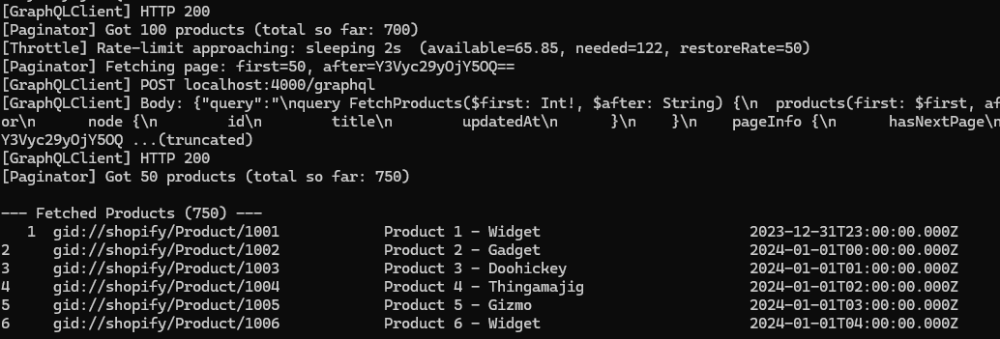

# graphql_sync

C++ GraphQL client with **Shopify-style pagination** and **cost-based throttling**. Demonstrates migrating a C++ Shopify REST integration to the Shopify Admin GraphQL API.

**Features**

- Cursor-based pagination (`products(first:, after:)` / `pageInfo.hasNextPage`)
- Cost-based rate limiting via `extensions.cost.throttleStatus`
- Retries with exponential back-off + jitter (HTTP 429, 5xx, timeouts)
- GraphQL error handling (HTTP 200 with `"errors": [...]` in body)

Runs locally against a bundled Node.js mock server — no Shopify credentials required.


## Table of contents

- [Repository layout](#repository-layout)
- [Prerequisites](#prerequisites)
- [Quick start](#quick-start)
- [Run](#run)
- [Testing](#testing)
- [Example output](#example-output)
- [Design](#design)
- [License](#license)


## Repository layout

```
/
├── CMakeLists.txt
├── CMakePresets.json
├── CMakeUserPresets.json
├── README.md
├── conanfile.txt
├── src/
│   ├── main.cpp
│   ├── graphql_client.hpp/cpp
│   ├── throttle.hpp/cpp
│   ├── pagination.hpp/cpp
│   ├── mapping.hpp/cpp
│   ├── models.hpp
│   ├── queries.hpp
│   └── util.hpp/cpp
├── tests/
│   ├── test_util.cpp           # Unit tests: URL parsing, backoff
│   ├── test_mapping.cpp        # Unit tests: JSON→Product mapping
│   ├── test_throttle.cpp       # Unit tests: ThrottleController
│   └── test_integration.cpp    # Integration tests (needs mock server)
├── server_mock/
│   ├── package.json
│   ├── index.js
│   └── README.md
└── docs/
    └── example-output.png
```


## Prerequisites

| Requirement | Notes |
|-------------|--------|
| **C++20** | MSVC 2019+, GCC 10+, Clang 12+ |
| **CMake** | ≥ 3.16 |
| **Node.js** | ≥ 16 (for mock server) |
| **OpenSSL** | Optional; enables HTTPS |

### Conan (recommended)

Conan supplies **Boost**, **nlohmann_json**, and **OpenSSL**. Install [Conan](https://conan.io/) and use the project presets.

**Release (one-time):**
```powershell
conan install . --output-folder=build --build=missing
```

**Debug (for `conan-debug` preset):**
```powershell
conan install . -s build_type=Debug --output-folder=build_debug --build=missing
```

In Visual Studio, select **conan-release** or **conan-debug** in the CMake preset dropdown — not "x64 Debug" / "x64 Release".  
**Troubleshooting:** "Could NOT find Boost" or "Could NOT find nlohmann_json" → switch to a Conan preset and use **Project** → **Delete Cache and Reconfigure**.

### Without Conan

- **Windows (vcpkg):** `vcpkg install boost-beast boost-asio boost-system` then pass `-DCMAKE_TOOLCHAIN_FILE=[vcpkg root]/scripts/buildsystems/vcpkg.cmake` to CMake.
- **Linux (apt):** `sudo apt install libboost-all-dev`
- **macOS (Homebrew):** `brew install boost`


## Quick start

**1. Start the mock server**

```bash
cd server_mock
npm install
npm start
```

You should see: `Mock Shopify GraphQL server running at http://localhost:4000/graphql`

**2. Build the C++ client**

- **With Conan:** Open the project in Visual Studio, choose **conan-release** (or **conan-debug**), then build.
- **Without Conan:**
  ```bash
  cmake -B build -DCMAKE_BUILD_TYPE=Release
  cmake --build build --config Release
  ```


## Run

**Windows:**
```powershell
.\build\build\Release\graphql_sync.exe --endpoint http://localhost:4000/graphql --total 250 --page-size 50 --timeout-ms 5000
```

**Linux/macOS:**
```bash
./build/graphql_sync --endpoint http://localhost:4000/graphql --total 250 --page-size 50 --timeout-ms 5000
```

Use `--verbose` for per-request logs.

**From Visual Studio 2022:** Set **Startup Item** to **graphql_sync (mock server args)** (see `launch.vs.json`), or set **Command Arguments** to:
`--endpoint http://localhost:4000/graphql --total 250 --page-size 50 --timeout-ms 5000`

### CLI options

| Flag | Default | Description |
|------|---------|-------------|
| `--endpoint URL` | `http://localhost:4000/graphql` | GraphQL endpoint |
| `--total N` | `250` | Max products to fetch |
| `--page-size N` | `50` | Products per page |
| `--timeout-ms N` | `5000` | HTTP timeout (ms) |
| `--verbose` | off | Per-request debug output |


## Testing

The project uses **Google Test** for unit and integration tests. Tests are built automatically when `BUILD_TESTS=ON` (the default).

### Prerequisites

After adding `gtest/1.14.0` to the Conan dependencies, re-run Conan install:

```powershell
conan install . --output-folder=build --build=missing
```

Or for Debug:

```powershell
conan install . -s build_type=Debug --output-folder=build_debug --build=missing
```

Then reconfigure CMake (in Visual Studio: **Project → Delete Cache and Reconfigure**).

### Unit tests (no server needed)

Unit tests cover URL parsing, exponential backoff, JSON-to-Product mapping, error extraction, and throttle controller logic. They run entirely in-process with no network.

```powershell
# After building, run from the build directory:
ctest -R unit_tests --output-on-failure

# Or run the executable directly:
.\build\build\Release\unit_tests.exe
```

### Integration tests (needs mock server)

Integration tests exercise the full pipeline — HTTP client, pagination, retries, and throttling — against the bundled mock server.

**1. Start the mock server** (in a separate terminal):

```bash
cd server_mock
npm start
```

**2. Run the integration tests:**

```powershell
ctest -R integration_tests --output-on-failure

# Or run the executable directly:
.\build\build\Release\integration_tests.exe
```

If the mock server is not running, integration tests are **skipped** (not failed).

### Test summary

| Suite | Tests | What it covers | Needs server? |
|-------|-------|----------------|---------------|
| `unit_tests` | ~30 | `parseUrl`, `computeBackoffMs`, `parseProductNode`, `parseProductsPage`, `extractGraphqlErrors`, `ThrottleController` | No |
| `integration_tests` | 5 | Full pagination, data integrity, stats, raw GraphQL requests | Yes |

### Disabling tests

To build without tests, pass `-DBUILD_TESTS=OFF` to CMake:

```powershell
cmake -B build -DBUILD_TESTS=OFF
```


## Example output

With `--verbose`, you’ll see GraphQL requests, pagination, and throttle sleeps. Example:



**Without verbose**, a typical run looks like:

```
=== graphql_sync ===
Endpoint:   http://localhost:4000/graphql
Total:      250
Page size:  50
Timeout:    5000 ms
Verbose:    no
====================

--- Fetched Products (250) ---
   1  gid://shopify/Product/1001   Product 1 - Widget       2024-01-01T01:00:00.000Z
   2  gid://shopify/Product/1002   Product 2 - Gadget      2024-01-01T02:00:00.000Z
   ...
 250  gid://shopify/Product/1250   Product 250 - Gizmo      2024-01-11T10:00:00.000Z

=== Summary Report ===
Total fetched:       250
Total requests:      5
Total retries:       0
Total sleep (s):     0.00
Avg query cost:      52.00
======================
```

## Design

**GraphQL errors in HTTP 200** — The client always checks for `"errors": [...]` in the body before using `data`.

**Cursor pagination** — Uses `edges[].cursor` and `pageInfo.hasNextPage`; the last cursor is sent as `after` on the next request.

**Cost-based throttling** — Reads `extensions.cost.throttleStatus` and sleeps before the next request when the remaining budget is too low.

**Retry policy**

| Condition | Action |
|-----------|--------|
| HTTP 429, 5xx, timeout | Retry with back-off (6 attempts, 200 ms → 5000 ms + jitter) |
| Other errors | Fail immediately |

**HTTPS** — Supported when OpenSSL is available at build time; the mock server uses HTTP.

## License

MIT License.
